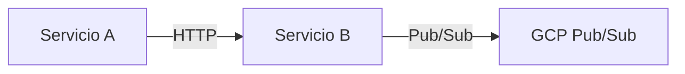

# Contribuir a ColabBoard Docs

Este sitio de documentación es la fuente de verdad para toda la plataforma ColabBoard. Cada equipo de servicio es responsable de su propia sección.

## Cómo Añadir Documentación para Tu Servicio

1. **Crea una carpeta** en `docs/` para tu servicio:
   ```
   docs/
   ├── overview/
   ├── sse-service/
   ├── session-service/     ← añade tus archivos aquí
   ├── session-db/
   ├── web-app/
   └── infrastructure/
   ```

2. **Crea archivos Markdown o MDX** en tu carpeta:
   ```bash
   # Ejemplo
   docs/session-service/overview.md
   docs/session-service/api-reference.md
   docs/session-service/authentication.md
   ```

   Cada archivo necesita front matter:
   ```markdown
   ---
   id: overview
   title: Session Service Overview
   sidebar_label: Overview
   ---
   ```

3. **Actualiza `sidebars.ts`** — añade tus páginas a la categoría correspondiente:
   ```typescript
   {
     type: 'category',
     label: '🔐 Session Service',
     collapsed: false,
     items: [
       'session-service/overview',
       'session-service/api-reference',
       'session-service/authentication',
     ],
   },
   ```

4. **Vista previa local:**
   ```bash
   cd ColabBoard_Docs
   npm start
   # Abre http://localhost:3000
   ```

5. **Verificar la build:**
   ```bash
   npm run build
   # Docusaurus comprueba automáticamente los enlaces rotos
   ```

6. **Envía un Pull Request** a `main`. El workflow de GitHub Actions desplegará automáticamente a GitHub Pages cuando el PR sea mergeado.

---

## Convenciones de Markdown / MDX

### Front Matter

Cada archivo `.md` debe tener front matter:

```markdown
---
id: id-único-dentro-de-la-carpeta
title: Título Completo de la Página
sidebar_label: Etiqueta Corta (mostrada en el sidebar)
---
```

### Bloques de Código

Usa bloques de código delimitados con un identificador de lenguaje para el resaltado de sintaxis:

````markdown
```csharp
public record WorkspaceEvent(string EventType, string UserId, string WorkspaceId);
```
````

Lenguajes soportados: `csharp`, `bash`, `json`, `docker`, `typescript`, `powershell`, `yaml`.

### Admonitions

Usa los admonitions de Docusaurus para notas, advertencias y avisos:

```markdown
:::note
Esto es una nota.
:::

:::warning
Esto es una advertencia.
:::

:::tip
Esto es un consejo.
:::

:::danger
Esto es un aviso de peligro.
:::
```

---

## Diagramas Mermaid

Usa Mermaid para los diagramas de arquitectura — se versionan como código y se renderizan automáticamente.

````markdown

````

Tipos de diagrama soportados: `flowchart`, `sequenceDiagram`, `graph`, `classDiagram`, `erDiagram`.

---

## Nomenclatura de Archivos

- Usa `kebab-case` para los nombres de archivo: `api-reference.md`, `getting-started.md`
- El campo `id` del front matter debe coincidir con el nombre del archivo (sin extensión)
- Mantén la ruta en `docs/` corta y descriptiva

---

## ¿Preguntas?

Abre un issue en este repositorio o contacta al equipo de plataforma de ColabBoard.
