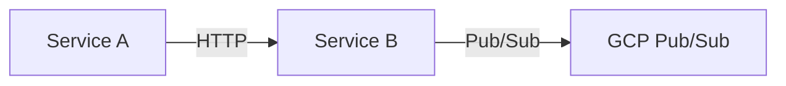

# Contributing to ColabBoard Docs

This documentation site is the single source of truth for the entire ColabBoard platform. Each service team is responsible for their own section.

## How to Add Documentation for Your Service

1. **Create a folder** under `docs/` for your service:
   ```
   docs/
   ├── overview/
   ├── sse-service/
   ├── session-service/     ← add your files here
   ├── session-db/
   ├── web-app/
   └── infrastructure/
   ```

2. **Create Markdown or MDX files** in your folder:
   ```bash
   # Example
   docs/session-service/overview.md
   docs/session-service/api-reference.md
   docs/session-service/authentication.md
   ```

   Every file needs front matter:
   ```markdown
   ---
   id: overview
   title: Session Service Overview
   sidebar_label: Overview
   ---
   ```

3. **Update `sidebars.ts`** — add your pages to the appropriate category:
   ```typescript
   {
     type: 'category',
     label: '🔐 Session Service',
     collapsed: false,
     items: [
       'session-service/overview',
       'session-service/api-reference',
       'session-service/authentication',
     ],
   },
   ```

4. **Preview locally:**
   ```bash
   cd ColabBoard_Docs
   npm start
   # Opens http://localhost:3000
   ```

5. **Verify the build:**
   ```bash
   npm run build
   # Docusaurus checks for broken links automatically
   ```

6. **Submit a Pull Request** to `main`. The GitHub Actions workflow will automatically deploy to GitHub Pages when the PR is merged.

---

## Markdown / MDX Conventions

### Front Matter

Every `.md` file must have front matter:

```markdown
---
id: unique-id-within-the-folder
title: Full Page Title
sidebar_label: Short Label (shown in sidebar)
---
```

### Code Blocks

Use fenced code blocks with a language identifier for syntax highlighting:

````markdown
```csharp
public record WorkspaceEvent(string EventType, string UserId, string WorkspaceId);
```
````

Supported languages include: `csharp`, `bash`, `json`, `docker`, `typescript`, `powershell`, `yaml`.

### Admonitions

Use Docusaurus admonitions for notes, warnings, and cautions:

```markdown
:::note
This is a note.
:::

:::warning
This is a warning.
:::

:::tip
This is a tip.
:::

:::danger
This is a danger notice.
:::
```

---

## Mermaid Diagrams

Use Mermaid for architecture diagrams — they are version-controlled as code and rendered automatically.

````markdown

````

Supported diagram types: `flowchart`, `sequenceDiagram`, `graph`, `classDiagram`, `erDiagram`.

---

## File Naming

- Use `kebab-case` for file names: `api-reference.md`, `getting-started.md`
- Match the `id` front matter to the file name (without extension)
- Keep the `docs/` path short and descriptive

---

## Questions?

Open an issue in this repository or reach out to the ColabBoard platform team.
