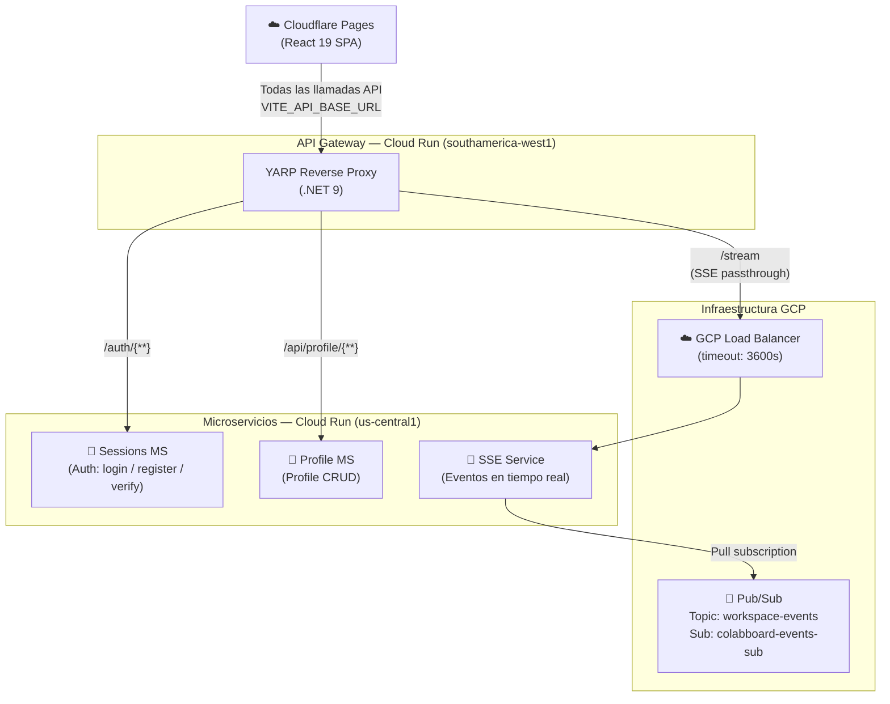
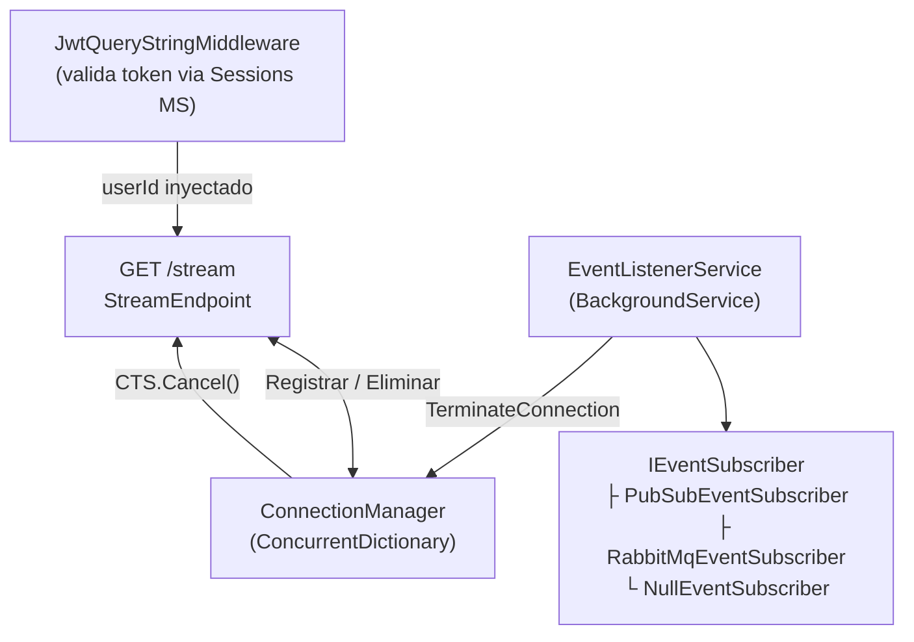

# ColabBoard — Visión General de Arquitectura

ColabBoard es un conjunto de microservicios que juntos forman una plataforma de workspace colaborativo en tiempo real.

## Arquitectura Completa del Sistema

## Flujo de Requests

| Request del Navegador | Ruta | Gestionado Por |
|---|---|---|
| `POST /auth/login` | API Gateway → Sessions MS | Autenticación |
| `POST /auth/register` | API Gateway → Sessions MS | Registro |
| `GET /api/profile/me` | API Gateway → Profile MS | Obtención de perfil |
| `POST /api/profile` | API Gateway → Profile MS | Creación de perfil |
| `GET /stream?...&token=...` | API Gateway → Load Balancer → SSE Service | Eventos en tiempo real |

## Componentes Internos del SSE Service

## Flujo de Datos SSE (paso a paso)

1. El navegador abre una conexión persistente `GET /stream?workspaceId=...&token=<jwt>` mediante `EventSource`.
2. El **API Gateway** reenvía el request al **SSE Service** con el buffering de respuesta desactivado.
3. **`JwtQueryStringMiddleware`** valida el token llamando al Sessions MS en `/auth/verify`. Si es exitoso, `userId` se almacena en `HttpContext.Items`.
4. **`StreamEndpoint`** configura los headers SSE y escribe el evento inicial `connected` con `retry: 5000`.
5. La conexión se registra en **`ConnectionManager`**. Comentarios periódicos de `heartbeat` mantienen la conexión TCP activa cada 15 s.
6. **`EventListenerService`** recibe un `USER_REMOVED_FROM_WORKSPACE_EVENT` desde Pub/Sub y llama a `ConnectionManager.TerminateConnection()`, que envía `event: connection-terminated` al navegador.
7. El hook `useSSE` del navegador gestiona el evento — para `access_revoked` redirige a `/workspaces`; para `server_shutdown` muestra un toast de "Reconectando…" y permite que `EventSource` se reconecte automáticamente tras 5 s.

## Servicios

| Servicio | Tecnología | Estado | Región Cloud Run |
|---|---|---|---|
| **Web App** | React 19, Vite 6 | Desplegado (Cloudflare Pages) | — |
| **API Gateway** | .NET 9, YARP | Desplegado | `southamerica-west1` |
| **SSE Service** | .NET 9, ASP.NET Core | Desplegado | `southamerica-west1` |
| **Sessions MS** | — | Desplegado | `us-central1` |
| **Profile MS** | — | Desplegado | `us-central1` |
| **Workspace MS** | — | Planificado | — |
| **Tasks MS** | — | Planificado | — |
