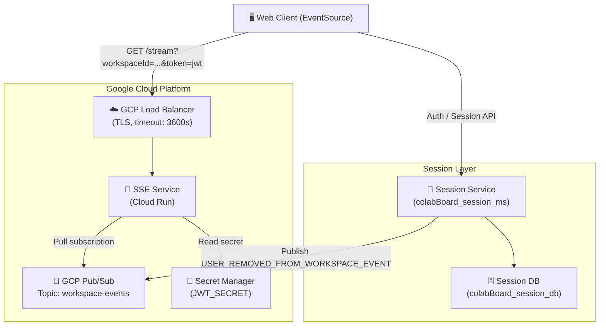
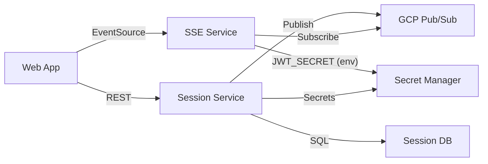

# ColabBoard — Architecture Overview

ColabBoard is a set of loosely-coupled microservices that together deliver a real-time collaborative workspace platform. Each service has a single, well-defined responsibility and communicates over HTTP or an async message bus.

## System Architecture Diagram

## Services

| Service | Repository | Technology | Responsibility |
|---|---|---|---|
| **SSE Service** | `colabBoard_SSE_service` | ASP.NET Core 9 | Delivers real-time events to browser clients over SSE |
| **Session Service** | `colabBoard_session_ms` | TBD | Manages user sessions, workspace membership |
| **Session Database** | `colabBoard_session_db` | TBD | Persistent store for session and workspace data |
| **Web App** | `colabBoard_wa` | TBD | Browser client — consumes SSE stream, renders UI |
| **Infrastructure** | N/A | GCP | Pub/Sub, Cloud Run, Load Balancer, Secret Manager |

## Data Flow

1. A user authenticates via the **Session Service** and receives a signed JWT.
2. The browser opens a persistent `GET /stream` connection to the **SSE Service**, sending the JWT as a query parameter.
3. The **JWT Middleware** validates the token. On success the connection is registered in the in-memory `ConnectionManager`.
4. The browser receives an initial `connected` event and periodic `: heartbeat` comments to keep the TCP connection alive through load-balancer and proxy timeouts.
5. When a workspace administrator removes a user, the **Session Service** publishes a `USER_REMOVED_FROM_WORKSPACE_EVENT` to the **GCP Pub/Sub** topic.
6. The SSE Service's `EventListenerService` receives the event and calls `ConnectionManager.TerminateConnection()`, which sends an `event: connection-terminated` SSE event to the browser and closes the stream.
7. The browser `EventSource` API automatically attempts to reconnect after the configured `retry: 5000` ms delay.

## Service Dependency Map

