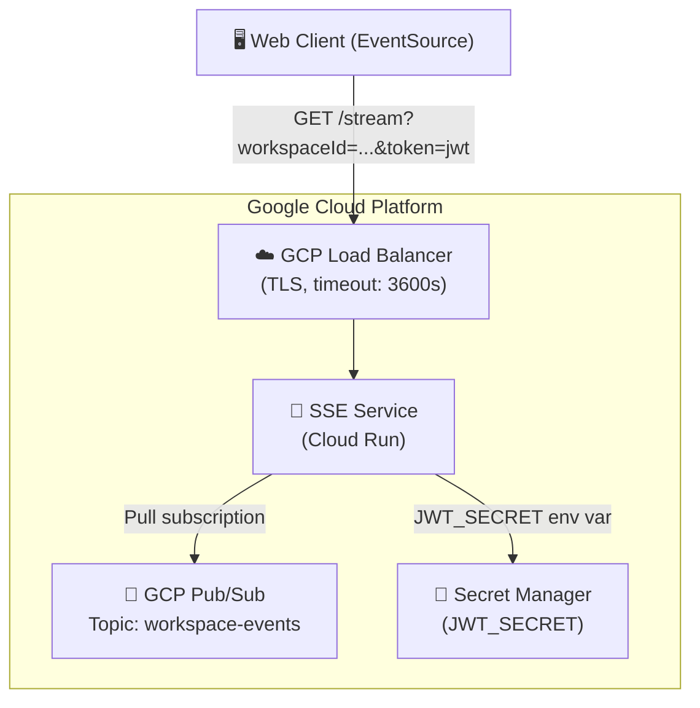
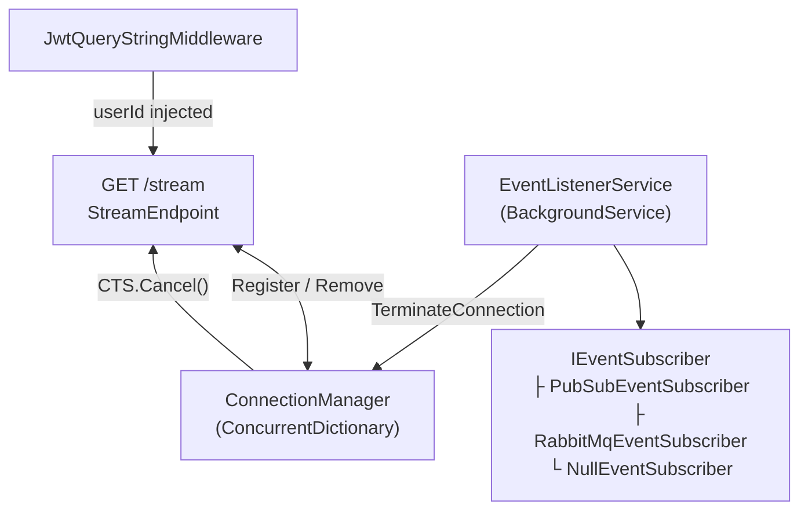

# ColabBoard — Architecture Overview

ColabBoard is a set of microservices that together deliver a real-time collaborative workspace platform. This page documents the system as it is known today; sections for other services will be added in future iterations.

## SSE Service Architecture

## SSE Service Internal Components

## Data Flow

1. The browser opens a persistent `GET /stream?workspaceId=...&token=<jwt>` connection to the **SSE Service**.
2. **`JwtQueryStringMiddleware`** validates the HS256 JWT. On success, `userId` is stored in `HttpContext.Items`.
3. **`StreamEndpoint`** sets SSE headers and writes the initial `connected` event with `retry: 5000`.
4. The connection is registered in **`ConnectionManager`**. Periodic `: heartbeat` comments keep the TCP connection alive.
5. **`EventListenerService`** receives a `USER_REMOVED_FROM_WORKSPACE_EVENT` from Pub/Sub and calls `ConnectionManager.TerminateConnection()`, which sends `event: connection-terminated` to the browser.
6. The browser `EventSource` automatically reconnects after 5 seconds.

## Services

| Service | Repository | Technology | Status |
|---|---|---|---|
| **SSE Service** | `colabBoard_SSE_service` | ASP.NET Core 9 | Documented |
| **Session Service** | `colabBoard_session_ms` | — | Coming soon |
| **Session Database** | `colabBoard_session_db` | — | Coming soon |
| **Web App** | `colabBoard_wa` | — | Coming soon |
