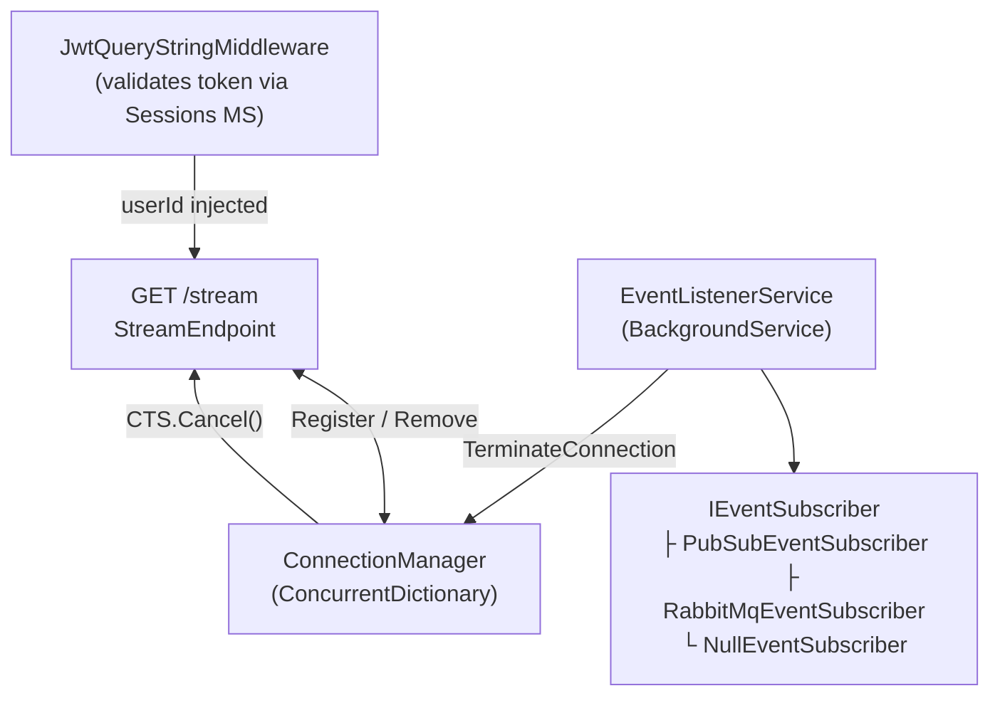

# ColabBoard — Architecture Overview

ColabBoard is a set of microservices that together deliver a real-time collaborative workspace platform.

## Full System Architecture

## Request Flow

| Browser Request | Route | Handled By |
|---|---|---|
| `POST /auth/login` | API Gateway → Sessions MS | Authentication |
| `POST /auth/register` | API Gateway → Sessions MS | Registration |
| `GET /api/profile/me` | API Gateway → Profile MS | Profile fetch |
| `POST /api/profile` | API Gateway → Profile MS | Profile creation |
| `GET /stream?...&token=...` | API Gateway → Load Balancer → SSE Service | Real-time events |

## SSE Service Internal Components

## SSE Data Flow (step-by-step)

1. The browser opens a persistent `GET /stream?workspaceId=...&token=<jwt>` connection via `EventSource`.
2. The **API Gateway** proxies the request to the **SSE Service** with response buffering disabled.
3. **`JwtQueryStringMiddleware`** validates the token by calling Sessions MS `/auth/verify`. On success, `userId` is stored in `HttpContext.Items`.
4. **`StreamEndpoint`** sets SSE headers and writes the initial `connected` event with `retry: 5000`.
5. The connection is registered in **`ConnectionManager`**. Periodic `heartbeat` comments keep the TCP connection alive every 15 s.
6. **`EventListenerService`** receives a `USER_REMOVED_FROM_WORKSPACE_EVENT` from Pub/Sub and calls `ConnectionManager.TerminateConnection()`, which sends `event: connection-terminated` to the browser.
7. The browser's `useSSE` hook handles the event — for `access_revoked` it redirects to `/workspaces`; for `server_shutdown` it shows a "Reconnecting…" toast and allows `EventSource` to auto-reconnect after 5 s.

## Services

| Service | Technology | Status | Cloud Run Region |
|---|---|---|---|
| **Web App** | React 19, Vite 6 | Deployed (Cloudflare Pages) | — |
| **API Gateway** | .NET 9, YARP | Deployed | `southamerica-west1` |
| **SSE Service** | .NET 9, ASP.NET Core | Deployed | `southamerica-west1` |
| **Sessions MS** | — | Deployed | `us-central1` |
| **Profile MS** | — | Deployed | `us-central1` |
| **Workspace MS** | — | Planned | — |
| **Tasks MS** | — | Planned | — |
