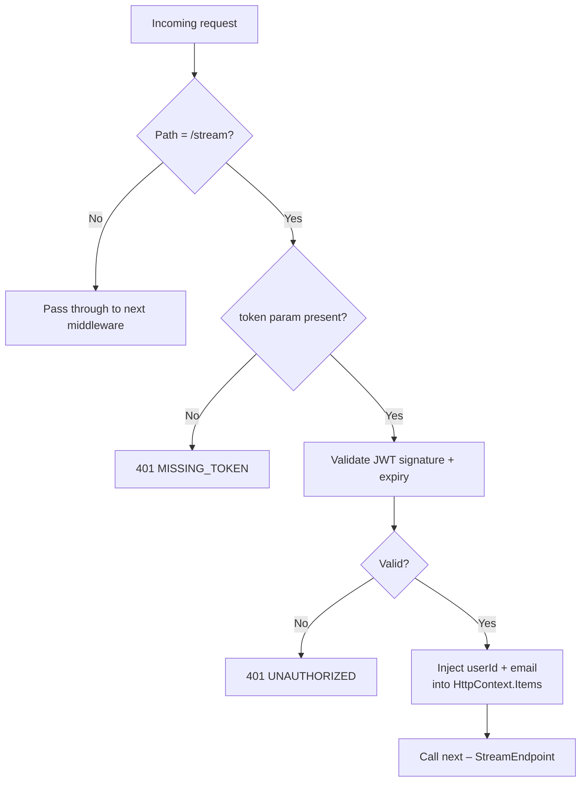

# Authentication

The SSE Service uses **HMAC-SHA256 (HS256) JWTs** for authentication. Because browser `EventSource` does not support custom HTTP headers, the JWT is passed as a `?token=` query-string parameter and validated by `JwtQueryStringMiddleware` before the request reaches any endpoint.

## Why Query-String Tokens?

The browser's native `EventSource` API does not allow setting the `Authorization` header. Alternatives—like wrapping the connection in a fetch call or using `@microsoft/fetch-event-source`—add complexity and reduce cross-browser compatibility. Passing the token as `?token=` is the pragmatic solution adopted by this service.

:::warning Security Note
Query-string tokens are visible in server access logs and browser history. Use HTTPS in production (enforced by the GCP Load Balancer) and set short token expiry times.
:::

## JwtQueryStringMiddleware

**File:** `src/ColabBoard.SSE/Middleware/JwtQueryStringMiddleware.cs`

The middleware only intercepts requests to `/stream`. All other paths pass through unmodified.

### Processing Pipeline



### Token Validation Parameters

| Parameter | Value |
|---|---|
| Algorithm | HS256 (HMAC-SHA256) |
| Signing key | `JWT_SECRET` (UTF-8 encoded) |
| Issuer validation | Enabled only when `JWT_ISSUER` is set |
| Audience validation | Disabled |
| Lifetime validation | Enabled |
| Clock skew tolerance | `JWT_CLOCK_SKEW_SECONDS` (default: 30s) |

### Claims Extraction

The middleware extracts `userId` and `email` from the token and stores them in `HttpContext.Items`:

```csharp
var userId = principal.FindFirstValue(ClaimTypes.NameIdentifier)
          ?? principal.FindFirstValue("sub")
          ?? principal.FindFirstValue("userId");

var email = principal.FindFirstValue(ClaimTypes.Email)
         ?? principal.FindFirstValue("email");

context.Items["UserId"] = userId;
context.Items["Email"] = email;
```

**Claim lookup order** for `userId`:
1. `ClaimTypes.NameIdentifier` (standard ASP.NET Core)
2. `sub` (JWT standard)
3. `userId` (custom claim)

`StreamEndpoint` reads `context.Items["UserId"]` defensively and returns `401` if it is null or empty.

## Generating Test Tokens

Use the included PowerShell script:

```powershell
# From the repository root:
.\gen-token.ps1
```

The script signs a JWT with the `JWT_SECRET` from the current environment and prints the full `?token=` URL for use with `curl`.

## Error Responses

| Condition | HTTP Status | Code |
|---|---|---|
| `token` query parameter is absent | `401` | `MISSING_TOKEN` |
| Token is invalid, expired, or malformed | `401` | `UNAUTHORIZED` |

Response body (all errors use the shared `ErrorResponse` record):

```json
{
  "code": "UNAUTHORIZED",
  "message": "Token is invalid or expired.",
  "timestamp": "2026-02-26T12:00:00.000Z"
}
```
