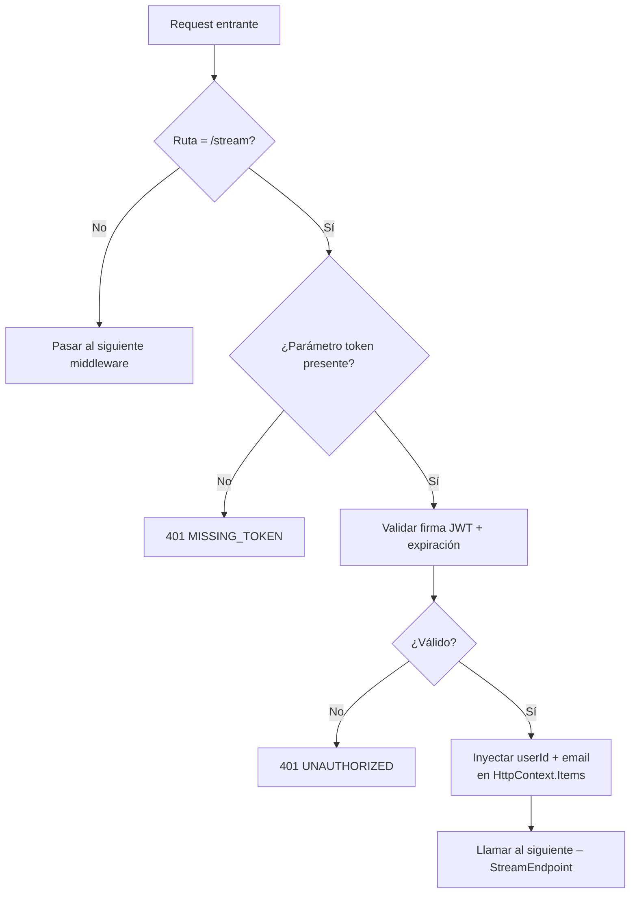

# Autenticación

El SSE Service usa **JWTs HMAC-SHA256 (HS256)** para la autenticación. Como el `EventSource` del navegador no soporta headers HTTP personalizados, el JWT se pasa como parámetro `?token=` en el query string y es validado por `JwtQueryStringMiddleware` antes de que el request llegue a cualquier endpoint.

## ¿Por qué tokens en el query string?

La API nativa `EventSource` del navegador no permite establecer el header `Authorization`. Las alternativas —como envolver la conexión en un fetch o usar `@microsoft/fetch-event-source`— añaden complejidad y reducen la compatibilidad entre navegadores. Pasar el token como `?token=` es la solución pragmática adoptada por este servicio.

:::warning Nota de Seguridad
Los tokens en el query string son visibles en los logs de acceso del servidor y en el historial del navegador. Usa HTTPS en producción (forzado por el GCP Load Balancer) y configura tiempos de expiración cortos.
:::

## JwtQueryStringMiddleware

**Archivo:** `src/ColabBoard.SSE/Middleware/JwtQueryStringMiddleware.cs`

El middleware solo intercepta requests hacia `/stream`. El resto de rutas pasan sin modificaciones.

### Pipeline de Procesamiento



### Parámetros de Validación del Token

| Parámetro | Valor |
|---|---|
| Algoritmo | HS256 (HMAC-SHA256) |
| Clave de firma | `JWT_SECRET` (codificado en UTF-8) |
| Validación de emisor | Habilitada solo si `JWT_ISSUER` está definido |
| Validación de audiencia | Deshabilitada |
| Validación de expiración | Habilitada |
| Tolerancia de desfase de reloj | `JWT_CLOCK_SKEW_SECONDS` (por defecto: 30s) |

### Extracción de Claims

El middleware extrae `userId` y `email` del token y los almacena en `HttpContext.Items`:

```csharp
var userId = principal.FindFirstValue(ClaimTypes.NameIdentifier)
          ?? principal.FindFirstValue("sub")
          ?? principal.FindFirstValue("userId");

var email = principal.FindFirstValue(ClaimTypes.Email)
         ?? principal.FindFirstValue("email");

context.Items["UserId"] = userId;
context.Items["Email"] = email;
```

**Orden de búsqueda del claim** `userId`:
1. `ClaimTypes.NameIdentifier` (estándar ASP.NET Core)
2. `sub` (estándar JWT)
3. `userId` (claim personalizado)

`StreamEndpoint` lee `context.Items["UserId"]` de forma defensiva y devuelve `401` si es null o vacío.

## Generar Tokens de Prueba

Usa el script PowerShell incluido en el repositorio:

```powershell
# Desde la raíz del repositorio:
.\gen-token.ps1
```

El script firma un JWT con el `JWT_SECRET` del entorno actual e imprime la URL completa con `?token=` lista para usar con `curl`.

## Respuestas de Error

| Condición | HTTP Status | Código |
|---|---|---|
| Parámetro `token` ausente en la query | `401` | `MISSING_TOKEN` |
| Token inválido, expirado o malformado | `401` | `UNAUTHORIZED` |

Cuerpo de respuesta (todos los errores usan el record compartido `ErrorResponse`):

```json
{
  "code": "UNAUTHORIZED",
  "message": "Token is invalid or expired.",
  "timestamp": "2026-02-26T12:00:00.000Z"
}
```
