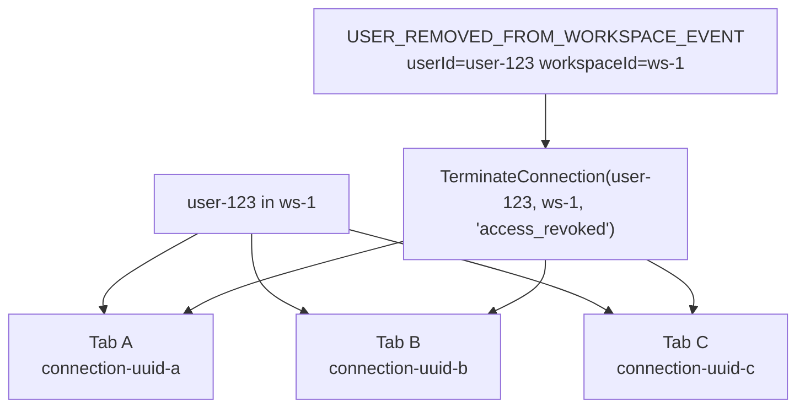

# Connection Management

`ConnectionManager` is a thread-safe, in-memory registry of all active SSE connections. It is registered as a `Singleton` in DI.

**File:** `src/ColabBoard.SSE/Services/ConnectionManager.cs`

## Data Structures

`ConnectionManager` uses a **dual-dictionary** design for O(1) lookup by either `connectionId` or `userId + workspaceId`:

```
_connections  ConcurrentDictionary<string, SseConnection>
              key: connectionId (UUID)
              value: SseConnection object

_index        ConcurrentDictionary<string, ConcurrentDictionary<string, byte>>
              key: "userId:workspaceId" composite key
              value: set of connectionIds (byte sentinel for value)
```

The secondary `_index` enables efficient lookup by user and workspace without iterating all connections—critical for the termination path triggered by `USER_REMOVED_FROM_WORKSPACE_EVENT`.

## SseConnection Model

```csharp
public sealed class SseConnection
{
    public string ConnectionId { get; init; } = Guid.NewGuid().ToString();
    public string UserId       { get; init; } = string.Empty;
    public string WorkspaceId  { get; init; } = string.Empty;
    public HttpResponse HttpResponse          { get; init; } = null!;
    public CancellationTokenSource CancellationTokenSource { get; init; } = null!;
    public DateTime ConnectedAt { get; init; } = DateTime.UtcNow;
    public string? TerminationReason { get; set; }   // set before CTS.Cancel()
}
```

## Multi-Tab Support

Because the secondary index maps `"userId:workspaceId"` to a **set** of `connectionId`s, a single user can have multiple concurrent SSE connections to the same workspace (e.g. multiple browser tabs). All of them are terminated together when `TerminateConnection` is called.



## API

### `Register(SseConnection connection)`

Adds a new connection to both the primary dictionary and the secondary index. Called by `StreamEndpoint` at the start of the SSE loop.

### `Remove(string connectionId)`

Removes a connection from both data structures and disposes its `CancellationTokenSource`. Called in the `finally` block of `StreamEndpoint` to guarantee cleanup on both normal and abnormal exit.

### `FindByUserAndWorkspace(string userId, string workspaceId)`

Returns all active `SseConnection` objects for a `userId + workspaceId` combination. Returns an empty list if none exist.

### `TerminateConnection(string userId, string workspaceId, string reason)`

1. Calls `FindByUserAndWorkspace` to get all matching connections.
2. Sets `connection.TerminationReason = reason` on each.
3. Calls `connection.CancellationTokenSource.Cancel()` on each.

The cancellation propagates to the heartbeat loop in `StreamEndpoint`, which catches `OperationCanceledException` and writes the `connection-terminated` SSE event before returning.

### `TerminateAll(string reason)`

Cancels **all** active connections. Called during graceful shutdown via the `ApplicationStopping` lifetime hook:

```csharp
app.Lifetime.ApplicationStopping.Register(() =>
{
    connectionManager.TerminateAll("server_shutdown");
    Thread.Sleep(500); // give request threads time to flush the termination event
});
```

### `ActiveConnectionCount`

Returns the current number of active connections (`_connections.Count`). Used by the `/health` endpoint.

## Thread Safety

All operations are thread-safe:
- `ConcurrentDictionary` provides lock-free reads and fine-grained locking for writes.
- `TerminationReason` is set before `CTS.Cancel()` to avoid a race condition where the request thread reads the reason after cancellation.
- The `finally` block in `StreamEndpoint` calls `Remove()` unconditionally, preventing leaked entries even on unexpected exceptions.
