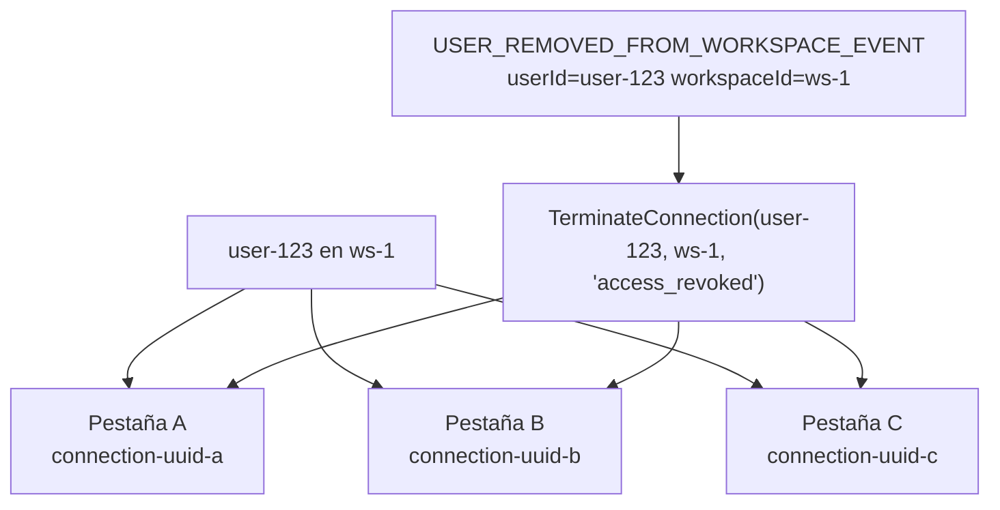

# Gestión de Conexiones

`ConnectionManager` es un registro en memoria, thread-safe, de todas las conexiones SSE activas. Se registra como `Singleton` en el contenedor de DI.

**Archivo:** `src/ColabBoard.SSE/Services/ConnectionManager.cs`

## Estructuras de Datos

`ConnectionManager` usa un diseño de **doble diccionario** para obtener búsqueda O(1) tanto por `connectionId` como por `userId + workspaceId`:

```
_connections  ConcurrentDictionary<string, SseConnection>
              clave: connectionId (UUID)
              valor: objeto SseConnection

_index        ConcurrentDictionary<string, ConcurrentDictionary<string, byte>>
              clave: clave compuesta "userId:workspaceId"
              valor: conjunto de connectionIds (byte centinela como valor)
```

El índice secundario `_index` permite búsquedas eficientes por usuario y workspace sin iterar todas las conexiones — crítico para la ruta de terminación disparada por `USER_REMOVED_FROM_WORKSPACE_EVENT`.

## Modelo SseConnection

```csharp
public sealed class SseConnection
{
    public string ConnectionId { get; init; } = Guid.NewGuid().ToString();
    public string UserId       { get; init; } = string.Empty;
    public string WorkspaceId  { get; init; } = string.Empty;
    public HttpResponse HttpResponse          { get; init; } = null!;
    public CancellationTokenSource CancellationTokenSource { get; init; } = null!;
    public DateTime ConnectedAt { get; init; } = DateTime.UtcNow;
    public string? TerminationReason { get; set; }   // se asigna antes de CTS.Cancel()
}
```

## Soporte Multi-Pestaña

Como el índice secundario mapea `"userId:workspaceId"` a un **conjunto** de `connectionId`s, un mismo usuario puede tener múltiples conexiones SSE concurrentes al mismo workspace (p. ej. varias pestañas del navegador). Todas ellas se terminan juntas cuando se llama a `TerminateConnection`.



## API

### `Register(SseConnection connection)`

Añade una nueva conexión tanto al diccionario principal como al índice secundario. Lo llama `StreamEndpoint` al inicio del bucle SSE.

### `Remove(string connectionId)`

Elimina una conexión de ambas estructuras de datos y libera su `CancellationTokenSource`. Se llama en el bloque `finally` de `StreamEndpoint` para garantizar la limpieza tanto en salida normal como en caso de excepción.

### `FindByUserAndWorkspace(string userId, string workspaceId)`

Devuelve todos los objetos `SseConnection` activos para una combinación `userId + workspaceId`. Devuelve una lista vacía si no existe ninguno.

### `TerminateConnection(string userId, string workspaceId, string reason)`

1. Llama a `FindByUserAndWorkspace` para obtener todas las conexiones coincidentes.
2. Asigna `connection.TerminationReason = reason` en cada una.
3. Llama a `connection.CancellationTokenSource.Cancel()` en cada una.

La cancelación se propaga al bucle de heartbeat en `StreamEndpoint`, que captura la `OperationCanceledException` y escribe el evento SSE `connection-terminated` antes de retornar.

### `TerminateAll(string reason)`

Cancela **todas** las conexiones activas. Se llama durante el apagado graceful mediante el hook de ciclo de vida `ApplicationStopping`:

```csharp
app.Lifetime.ApplicationStopping.Register(() =>
{
    connectionManager.TerminateAll("server_shutdown");
    Thread.Sleep(500); // dar tiempo a los hilos de request para enviar el evento de terminación
});
```

### `ActiveConnectionCount`

Devuelve el número actual de conexiones activas (`_connections.Count`). Lo usa el endpoint `/health`.

## Thread Safety

Todas las operaciones son thread-safe:
- `ConcurrentDictionary` proporciona lecturas sin bloqueo y bloqueo de grano fino para escrituras.
- `TerminationReason` se asigna antes de `CTS.Cancel()` para evitar una condición de carrera donde el hilo del request lee el motivo después de la cancelación.
- El bloque `finally` en `StreamEndpoint` llama a `Remove()` incondicionalmente, evitando entradas huérfanas incluso ante excepciones inesperadas.
