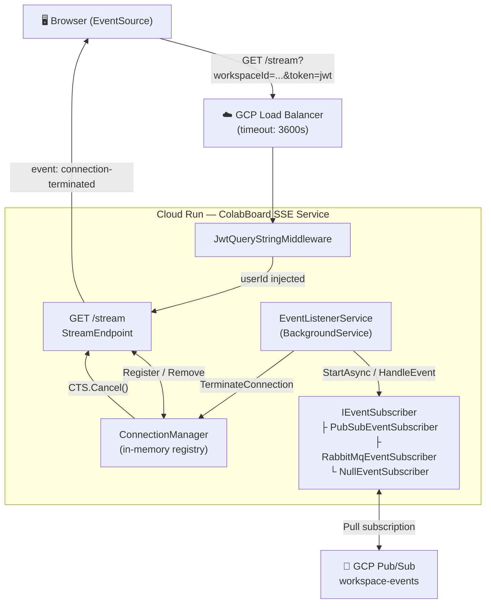

# SSE Service Overview

The `colabBoard_SSE_service` is a real-time **Server-Sent Events (SSE)** microservice built with **ASP.NET Core 9 Minimal API**. It maintains persistent HTTP connections with browser clients, authenticates them via JWT extracted from the query string, tracks connections in-memory with a thread-safe registry, and reactively terminates connections when a `USER_REMOVED_FROM_WORKSPACE_EVENT` is received from **GCP Pub/Sub** (or RabbitMQ for local development).

## Purpose

| Goal | Implementation |
|---|---|
| Real-time push events to browsers | SSE over persistent HTTP (`text/event-stream`) |
| Stateless JWT auth (browser `EventSource` can't set headers) | `JwtQueryStringMiddleware` extracts `?token=` |
| Multi-tab support | `ConnectionManager` tracks N connections per user+workspace |
| Instant access revocation | `USER_REMOVED_FROM_WORKSPACE_EVENT` → `TerminateConnection()` |
| Production-grade long-lived connections | Cloud Run + GCP Load Balancer with 3600s timeout |

## Architecture Diagram

## Data Flow (step-by-step)

1. **Client connects** — Browser opens `GET /stream?workspaceId=ws-1&token=<jwt>` via `EventSource`.
2. **JWT validation** — `JwtQueryStringMiddleware` validates the HS256 JWT. On success, `userId` and `email` are stored in `HttpContext.Items`. On failure, `401 Unauthorized` is returned immediately.
3. **SSE preamble** — `StreamEndpoint` sets `Content-Type: text/event-stream` headers and writes the initial `connected` event with `retry: 5000`.
4. **Connection registered** — An `SseConnection` object (holding the `HttpResponse` and a linked `CancellationTokenSource`) is registered in `ConnectionManager`.
5. **Heartbeat loop** — Every `HEARTBEAT_INTERVAL_SECONDS` (default: 15s), a `: heartbeat\n\n` comment is flushed to the client to prevent proxy timeouts.
6. **Access-revocation event** — `EventListenerService` receives a `USER_REMOVED_FROM_WORKSPACE_EVENT` from the message broker. It calls `ConnectionManager.TerminateConnection(userId, workspaceId, "access_revoked")`.
7. **Termination** — The `CancellationTokenSource` for that connection is cancelled. `StreamEndpoint` catches `OperationCanceledException`, writes `event: connection-terminated\ndata: {"reason":"access_revoked"}`, and returns.
8. **Client reconnect** — The browser `EventSource` automatically reconnects after 5 seconds (honoring the `retry: 5000` directive). Since the JWT has been effectively revoked server-side (the event was triggered by workspace removal), the reconnected request will either fail JWT validation or trigger another termination.

## Technology Stack

| Component | Technology |
|---|---|
| Runtime | .NET 9, ASP.NET Core Minimal API |
| Hosting | GCP Cloud Run |
| Messaging (production) | GCP Pub/Sub pull subscription |
| Messaging (local dev) | RabbitMQ 3.x |
| Authentication | HS256 JWT |
| Containerisation | Docker on Alpine Linux |
