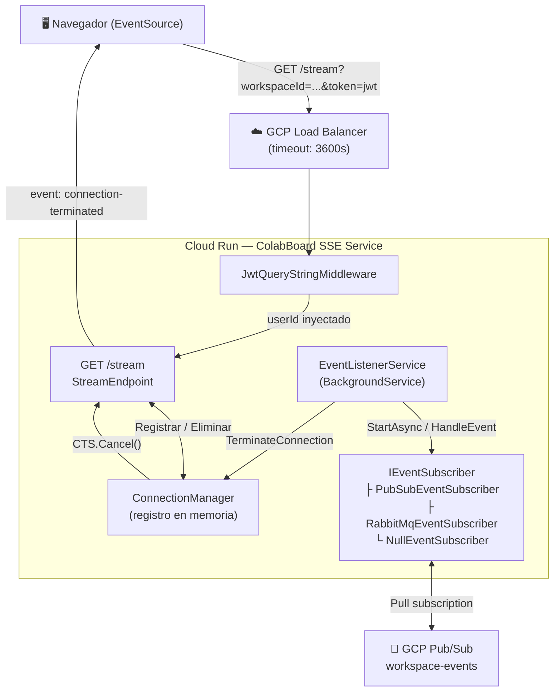

# SSE Service

El `colabBoard_SSE_service` es un microservicio de **Server-Sent Events (SSE)** en tiempo real construido con **ASP.NET Core 9 Minimal API**. Mantiene conexiones HTTP persistentes con los clientes del navegador, los autentica mediante JWT extraído del query string, registra las conexiones en memoria con un registro thread-safe, y termina reactivamente las conexiones cuando recibe un `USER_REMOVED_FROM_WORKSPACE_EVENT` desde **GCP Pub/Sub** (o RabbitMQ para desarrollo local).

## Propósito

| Objetivo | Implementación |
|---|---|
| Eventos push en tiempo real hacia navegadores | SSE sobre HTTP persistente (`text/event-stream`) |
| Auth JWT sin estado (el `EventSource` del navegador no puede establecer headers) | `JwtQueryStringMiddleware` extrae `?token=` |
| Soporte multi-pestaña | `ConnectionManager` registra N conexiones por usuario+workspace |
| Revocación de acceso instantánea | `USER_REMOVED_FROM_WORKSPACE_EVENT` → `TerminateConnection()` |
| Conexiones de larga duración en producción | Cloud Run + GCP Load Balancer con timeout de 3600s |

## Diagrama de Arquitectura

## Flujo de Datos (paso a paso)

1. **Cliente conecta** — El navegador abre `GET /stream?workspaceId=ws-1&token=<jwt>` mediante `EventSource`.
2. **Validación JWT** — `JwtQueryStringMiddleware` valida el JWT HS256. Si es exitoso, `userId` y `email` se almacenan en `HttpContext.Items`. Si falla, se devuelve `401 Unauthorized` inmediatamente.
3. **Preámbulo SSE** — `StreamEndpoint` configura los headers `Content-Type: text/event-stream` y escribe el evento inicial `connected` con `retry: 5000`.
4. **Conexión registrada** — Un objeto `SseConnection` (con el `HttpResponse` y un `CancellationTokenSource` vinculado) se registra en `ConnectionManager`.
5. **Bucle de heartbeat** — Cada `HEARTBEAT_INTERVAL_SECONDS` (por defecto: 15s), se envía al cliente un comentario `: heartbeat\n\n` para evitar timeouts de proxy.
6. **Evento de revocación de acceso** — `EventListenerService` recibe un `USER_REMOVED_FROM_WORKSPACE_EVENT` del broker de mensajes. Llama a `ConnectionManager.TerminateConnection(userId, workspaceId, "access_revoked")`.
7. **Terminación** — El `CancellationTokenSource` de esa conexión se cancela. `StreamEndpoint` captura la `OperationCanceledException`, escribe `event: connection-terminated\ndata: {"reason":"access_revoked"}` y retorna.
8. **Reconexión del cliente** — El `EventSource` del navegador se reconecta automáticamente tras 5 segundos (respetando la directiva `retry: 5000`). Como el JWT fue revocado en el servidor (el evento fue disparado por la eliminación del workspace), el request reconectado fallará la validación JWT o disparará otra terminación.

## Stack Tecnológico

| Componente | Tecnología |
|---|---|
| Runtime | .NET 9, ASP.NET Core Minimal API |
| Hosting | GCP Cloud Run |
| Mensajería (producción) | GCP Pub/Sub pull subscription |
| Mensajería (desarrollo local) | RabbitMQ 3.x |
| Autenticación | HS256 JWT |
| Contenedorización | Docker sobre Alpine Linux |
